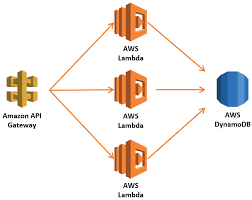
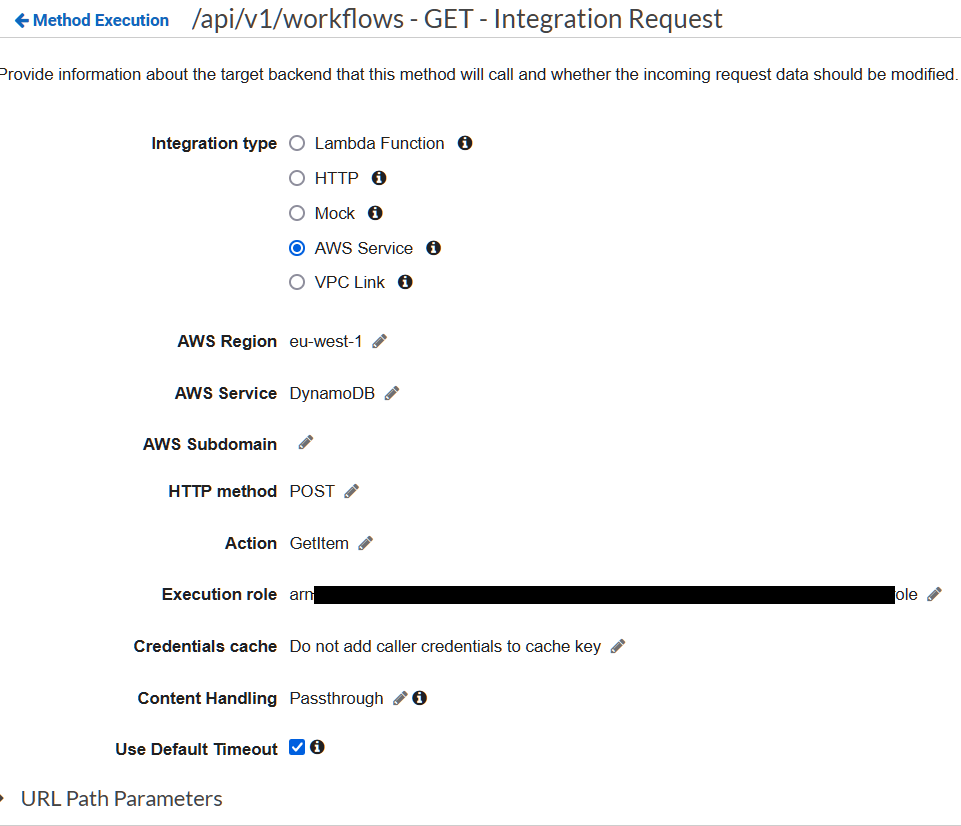
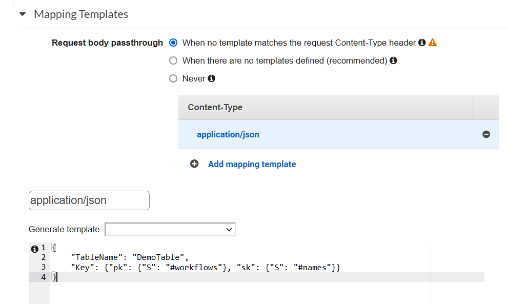
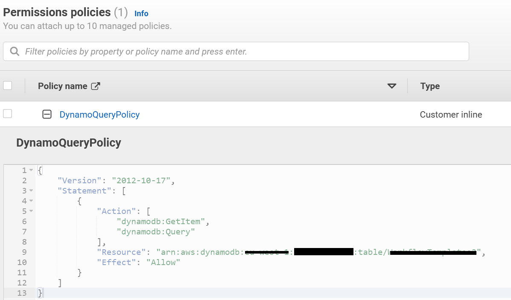
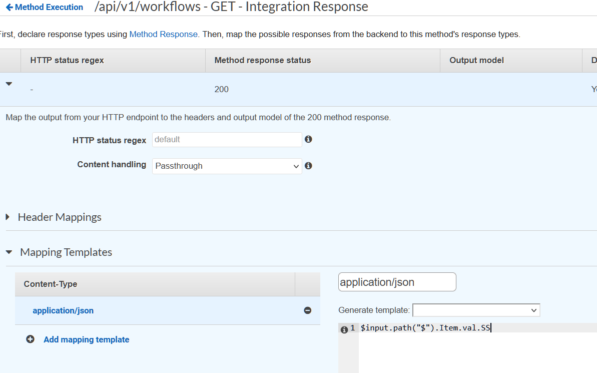

# API Gateway Direct Integration with DynamoDB

There are thousands of tutorials available which showcase the pattern of using a CRUD API as below



The lambda here can be a single function for each endpoint or a Fat lambda/Lambdalith handling multiple endpoints/methods.

In most of these scenarios, 
1. for PUT operations, the lambda **receives** the payload and after some manipulation stuffs the data into dynamo.
2. for GET operations, the lambda **queries** the dynamo, manipulates the data and returns the result to the API gateway
3. For some badly-designed scenarios, the lambda might **scan** the dynamo and return the results to the API gateway. This obviously is something which needs a rethink beyond the scope of this article

Let's consider how API gateway direct integration can help us in the above cases


## API Gateway Direct Integration

You use AWS API Gateway to forward a request directly to another AWS service. We have always been using this to forward our requests to lambdas.  
But we can also, for example, use a service proxy to send HTTP payloads directly to an SNS topic or to insert items directly to DynamoDB.

A service proxy has a number of benefits. You can provide a cheap, low-code way to ingest data from many distributed clients. By using an API Gateway service proxy, you can avoid running a full-time service whose sole purpose is to receive data and dump it into a different AWS service.


Now let's consider the scenarios we described above

# For GET operations

Instead of using a Lambda to query the dynamo, we can use API gateway direct integration with DynamoDB to service requests using 

<table>
<tr>
<td width="300">1. <b>IntegrationRequest</b>> with a <b>mapping template</b> to forward the request to DynamoDB</td>
<td></td>
</tr>
<tr>
<td>2. <b>mapping template</b> to query dynamoDB</td>
<td></td>
</tr>
<tr>
<td>3. an <b>IAM role</b> assumable by API gateway which allows dynamodb:GetItem and/or dynamodbQuery on the dynamodb table</td>
<td></td>
</tr>
<tr>
<td>4. <b>IntegrationResponse</b> with another <b>mapping template</b> to manipulate the DynamoDB response before sending back</td>
<td></td>
</tr>
</table>

These mapping templates are defined in a new-ish language called [Apache Velocity Template Language](https://velocity.apache.org/engine/devel/vtl-reference.html)

#### Pros of using this approach
1. No lambda needed, **low code**, no need for unit tests
2. No lambda cold start delays, no lambda concurrency limits
3. Very high though-put

#### Cons of using this approach
1. Debugging VTL is hard. There is a way of [evaluating templates for AppSync](https://aws.amazon.com/de/blogs/mobile/introducing-template-evaluation-and-unit-testing-for-aws-appsync-resolvers/), but so far I did not find a way for ApiGateway
2. You need to enable API gateway logging(which is a very verbose beast) and wade though those for if anything goes wrong 


# For PUT operations

Again, we can possibly use the direct integrations as above, **but should we**?

For database PUT operation we must consider **security** and **data validation** also along with throughput

### Security
Security as always depends on your situation.  
With the proxy technique, you still have security mechanisms, such as either direct Cognito user auth, or API keys.   
However, what if there are multiple attributes in the data/request that must be evaluated in combination to ensure security?
eg. We might need to restrict write access to specific users? This user info could come from another DB.   
For scenarios like this we should use a lambda instead of direct integration technique

### Data Validation
**Validating the incoming data, is probably the bigger reason to employ a Lambda in the flow.** While you can do some basic validation via the VTL templates, you are extremely limited, and it really doesn’t allow you to have the level of logic most would want when validating incoming data. Additionally, while the VTL could reject the data, it can’t be setup to provide any specifics on why it’s rejecting it.

With a Lambda, you can do things like enforce a JSON schema, ensure the specific values for various attributes fall within acceptable ranges/are valid values, etc.   
eg. think of a DynamoDB table for health tracking application, with heart rate as a numeric field. For a Numeric field, 1000 is a perfectly valid value, but for heart rate?  


# Experiments with Velocity Template Language

AWS loves VTL, probably because they love Java. [After all they made their own distribution](https://aws.amazon.com/corretto/)

For **AppSync and Amplify use-cases** the [Resolver Mapping Template reference](https://docs.aws.amazon.com/appsync/latest/devguide/resolver-mapping-template-reference.html) is key, as it details the helpers available to you, and the various service-specific (e.g. DynamoDB, Lambda, etc) template requirements.  
Unfortunately, API Gateway's [data transformations templates](https://docs.aws.amazon.com/apigateway/latest/developerguide/rest-api-data-transformations.html) are a lot limited in comparison

Some of the key features missing in API gateway compared to AppSync are as follows

| AppSync | API Gateway |
|---|---|
| Time helpers in $util.time eg <br>$util.time.nowEpochSeconds() <br> **$util.time.nowFormatted("yyyy-MM-dd HH:mm:ssZ")** <br> $util.time.epochMilliSecondsToFormatted($nowEpochMillis, "yyyy-MM-dd HH:mm:ssZ") | No $util.time available <br><br> only $context.requestTime and $context.requestTimeEpoch |
| IDs generating helpers eg $util.autoId() | no such functionality |
| DynamoHelpers eg the very useful **$util.dynamodb.toDynamoDB()** that converts input objects to the appropriate DynamoDB representation.| no such functionality |


You can always setup an API Gateway -> AppSync integration to use the extended VTL functionalities available, but this again is a design-overkill


## Some interesting VTL code I have used so far...

#### **$input variable** which represents the method request payload and parameters to be processed by a mapping template.
```text
#set($workflow_name = $input.params('workflow_name'))
```

#### if-else conditional blocks
```text
#if($workflow_name == "~")
    #set($pk = "query")
    #set($col_pk = "PKConstant")
#else
    #set($pk = $workflow_name)
#end
```
#### foreach to loop over a list

```
#foreach($elem in $inputRoot.Items) {
    "RunID": "$elem.PK.S"
    }#if($foreach.hasNext),#end
#end
```
#### string concat
```
#set($year_str = $context.requestTime.substring(7,11))
#set($start_of_year = "-01-01")
#set($from_date = "$year_str$start_of_year")
```
#### string to int conversion
````text
## https://stackoverflow.com/questions/2156502/how-to-convert-string-into-integer-in-the-velocity-template
#set($Integer = 0)
#set($year = $Integer.parseInt($year_str))
#set($eoy="-12-31")
#set($to_date = "$year$eoy")
````
#### string split
```text
## Using java string split in VTL
#set($splits = $last_key.split("#"))
#set($submission_date = $splits[1])
#set($workflow_name = $splits[0])
```

### converting dynamoDB json to json is a pain
apparently both AppSync and API gateway have removed support for macros, otherwise the following could have been useful  
https://gist.github.com/narenranjit/1672345